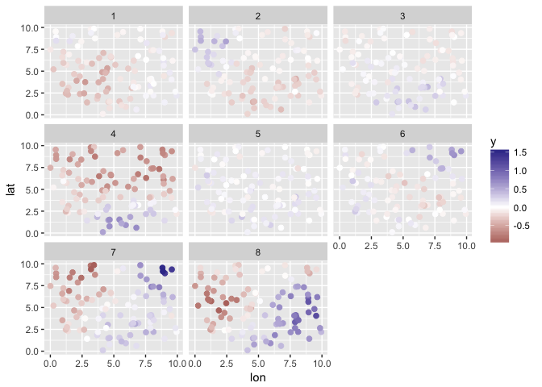
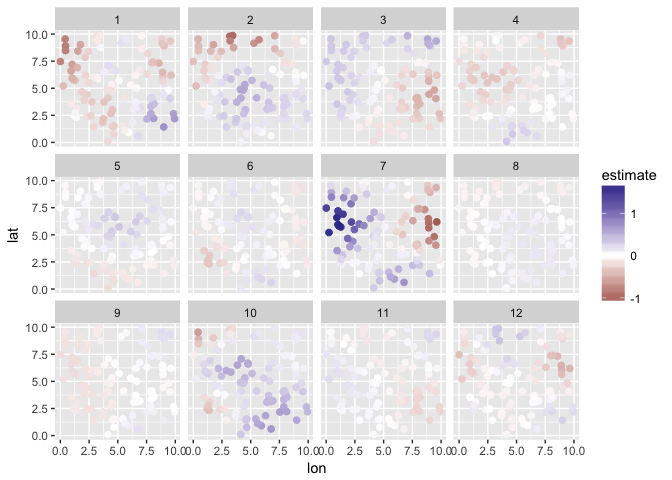
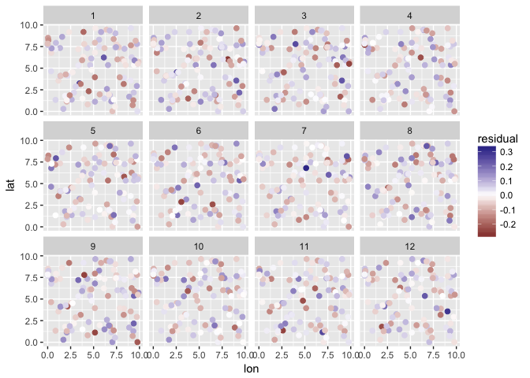
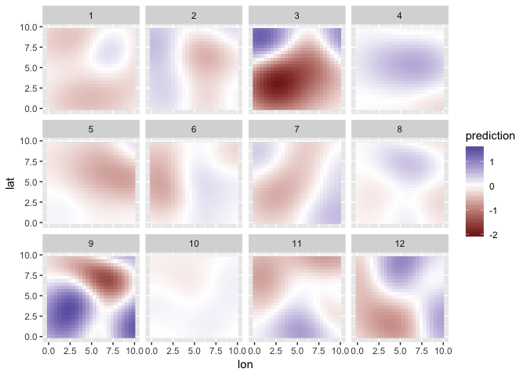

<!-- README.md is generated from README.Rmd. Please edit that file -->

# glmmfields 

[](https://github.com/seananderson/glmmfields/actions)
[](https://cran.r-project.org/package=glmmfields)
<!-- [](https://codecov.io/github/seananderson/glmmfields) -->

The glmmfields R package implements Bayesian spatiotemporal models that
allow for extreme spatial deviations through time. It uses a predictive
process approach with random fields implemented through a multivariate-t
distribution instead of a multivariate normal. The models are fit with
[Stan](http://mc-stan.org/).

We published a paper describing the model and package in *Ecology*:

Anderson, S. C., Ward, E. J. 2019. Black swans in space: modelling
spatiotemporal processes with extremes. 100(1):e02403.
<https://doi.org/10.1002/ecy.2403>

You can install the [CRAN
version](https://cran.r-project.org/package=glmmfields) of the package
with:

``` r
install.packages("glmmfields")
```

If you have a C++ compiler installed, you can install the development
version of the package with:

``` r
# install.packages("devtools")
devtools::install_github("seananderson/glmmfields", build_vignettes = TRUE)
```

glmmfields can also fit spatial GLMs with Stan. See the vignette:

``` r
vignette("spatial-glms", package = "glmmfields")
```

## An example spatiotemporal model

``` r
library(glmmfields)
#> Loading required package: Rcpp
library(ggplot2)
```

Simulate data:

``` r
set.seed(42)
s <- sim_glmmfields(
  df = 2.8, n_draws = 12, n_knots = 12, gp_theta = 2.5,
  gp_sigma = 0.2, sd_obs = 0.1
)
head(s$dat)
#>   time pt           y      lon      lat station_id
#> 1    1  1  0.02818963 9.148060 6.262453          1
#> 2    1  2 -0.21924739 9.370754 2.171577          2
#> 3    1  3 -0.34719485 2.861395 2.165673          3
#> 4    1  4 -0.15785483 8.304476 3.889450          4
#> 5    1  5 -0.04703617 6.417455 9.424557          5
#> 6    1  6 -0.23904924 5.190959 9.626080          6
```

``` r
print(s$plot)
```

<!-- -->

Fit the model:

``` r
options(mc.cores = parallel::detectCores()) # for parallel processing
m <- glmmfields(y ~ 0,
  data = s$dat, time = "time",
  lat = "lat", lon = "lon",
  nknots = 12, estimate_df = TRUE, iter = 800, seed = 1
)
```

``` r
print(m)
#> Inference for Stan model: glmmfields.
#> 4 chains, each with iter=800; warmup=400; thin=1; 
#> post-warmup draws per chain=400, total post-warmup draws=1600.
#> 
#>             mean se_mean   sd    2.5%     25%     50%     75%   97.5% n_eff Rhat
#> df[1]       3.78    0.04 1.40    2.09    2.73    3.45    4.44    7.46  1422 1.00
#> gp_sigma    0.30    0.00 0.04    0.22    0.27    0.30    0.33    0.39   441 1.01
#> gp_theta    2.59    0.00 0.06    2.46    2.55    2.59    2.63    2.71  1493 1.00
#> sigma[1]    0.10    0.00 0.00    0.09    0.10    0.10    0.10    0.10  1695 1.00
#> lp__     2291.18    0.41 9.24 2271.74 2285.06 2291.84 2297.72 2307.86   516 1.01
#> 
#> Samples were drawn using NUTS(diag_e) at Thu Apr 29 10:58:34 2021.
#> For each parameter, n_eff is a crude measure of effective sample size,
#> and Rhat is the potential scale reduction factor on split chains (at 
#> convergence, Rhat=1).
```

Plot:

``` r
plot(m, type = "prediction") + scale_color_gradient2()
```

<!-- -->

``` r
plot(m, type = "spatial-residual")
```

<!-- -->

Predictions:

``` r
# link scale:
p <- predict(m)
head(p)
#> # A tibble: 6 x 3
#>   estimate conf_low conf_high
#>      <dbl>    <dbl>     <dbl>
#> 1  -0.0292  -0.0864    0.0312
#> 2  -0.291   -0.361    -0.219 
#> 3  -0.397   -0.451    -0.344 
#> 4  -0.194   -0.271    -0.120 
#> 5  -0.0367  -0.111     0.0416
#> 6  -0.216   -0.294    -0.140

# posterior predictive intervals on new observations (include observation error):
p <- predictive_interval(m)
head(p)
#> # A tibble: 6 x 3
#>   estimate conf_low conf_high
#>      <dbl>    <dbl>     <dbl>
#> 1  -0.0292   -0.226    0.181 
#> 2  -0.291    -0.502   -0.0875
#> 3  -0.397    -0.611   -0.195 
#> 4  -0.194    -0.394    0.0112
#> 5  -0.0367   -0.243    0.175 
#> 6  -0.216    -0.425   -0.0100
```

Use the `tidy` method to extract parameter estimates as a data frame:

``` r
x <- tidy(m, conf.int = TRUE)
#> Warning in checkMatrixPackageVersion(): Package version inconsistency detected.
#> TMB was built with Matrix version 1.3.2
#> Current Matrix version is 1.2.18
#> Please re-install 'TMB' from source using install.packages('TMB', type = 'source') or ask CRAN for a binary version of 'TMB' matching CRAN's 'Matrix' package
#> Registered S3 method overwritten by 'broom.mixed':
#>   method      from 
#>   tidy.gamlss broom
head(x)
#> # A tibble: 6 x 5
#>   term                     estimate std.error conf.low conf.high
#>   <chr>                       <dbl>     <dbl>    <dbl>     <dbl>
#> 1 df[1]                      3.45     1.40      2.09      7.46  
#> 2 gp_sigma                   0.299    0.0442    0.217     0.389 
#> 3 gp_theta                   2.59     0.0640    2.46      2.71  
#> 4 sigma[1]                   0.0979   0.00216   0.0941    0.102 
#> 5 spatialEffectsKnots[1,1]  -0.110    0.0355   -0.182    -0.0413
#> 6 spatialEffectsKnots[2,1]  -0.230    0.0357   -0.302    -0.163
```

Make predictions on a fine-scale spatial grid:

``` r
pred_grid <- expand.grid(
  lat = seq(min(s$dat$lat), max(s$dat$lat), length.out = 25),
  lon = seq(min(s$dat$lon), max(s$dat$lon), length.out = 25),
  time = unique(s$dat$time)
)

pred_grid$prediction <- predict(m,
  newdata = pred_grid, type = "response", iter = 100, estimate_method = "median"
)$estimate

ggplot(pred_grid, aes(lon, lat, fill = prediction)) +
  facet_wrap(~time) +
  geom_raster() +
  scale_fill_gradient2()
```

<!-- -->

# References

Anderson, S. C., Ward, E. J. 2019. Black swans in space: modelling
spatiotemporal processes with extremes. 100(1):e02403.
<https://doi.org/10.1002/ecy.2403>

Latimer, A. M., S. Banerjee, H. Sang Jr, E. S. Mosher, and J. A.
Silander Jr. 2009. Hierarchical models facilitate spatial analysis of
large data sets: a case study on invasive plant species in the
northeastern United States. Ecology Letters 12:144–154.

Shelton, A. O., J. T. Thorson, E. J. Ward, and B. E. Feist. 2014.
Spatial semiparametric models improve estimates of species abundance and
distribution. Canadian Journal of Fisheries and Aquatic Sciences
71:1655–1666.

### NOAA Disclaimer

This repository is a scientific product and is not official
communication of the National Oceanic and Atmospheric Administration, or
the United States Department of Commerce. All NOAA GitHub project code
is provided on an ‘as is’ basis and the user assumes responsibility for
its use. Any claims against the Department of Commerce or Department of
Commerce bureaus stemming from the use of this GitHub project will be
governed by all applicable Federal law. Any reference to specific
commercial products, processes, or services by service mark, trademark,
manufacturer, or otherwise, does not constitute or imply their
endorsement, recommendation or favoring by the Department of Commerce.
The Department of Commerce seal and logo, or the seal and logo of a DOC
bureau, shall not be used in any manner to imply endorsement of any
commercial product or activity by DOC or the United States Government.
