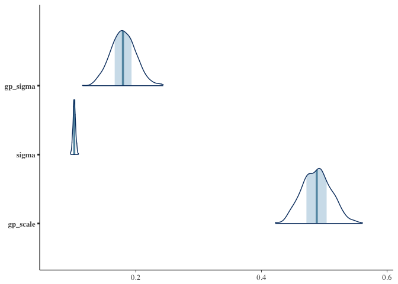

<!-- README.md is generated from README.Rmd. Please edit that file -->
rrfields
========

[](https://travis-ci.org/seananderson/rrfields) [](https://ci.appveyor.com/project/seananderson/rrfields) [](https://codecov.io/github/seananderson/rrfields)

The rrfields R package implements spatiotemporal models that allow for extreme spatial deviations through time. It uses a predictive process approach with random fields implemented through a multivariate-t distribution instead of a multivariate normal. The models are fit with [Stan](http://mc-stan.org/).

You can install the development version of the package with:

``` r
# install.packages("devtools")
devtools::install_github("seananderson/rrfields")
```

An example model
----------------

Simulate data:

``` r
library(rrfields)
set.seed(123)
s <- sim_rrfield(df = 3, n_draws = 8, n_knots = 10, gp_scale = 2.5, 
  gp_sigma = 0.2, sd_obs = 0.1)
head(s$dat)
#>   time pt           y      lon      lat
#> 1    1  1 -0.09253272 2.875775 5.999890
#> 2    1  2  0.15315838 7.883051 3.328235
#> 3    1  3 -0.49238502 4.089769 4.886130
#> 4    1  4 -0.04127106 8.830174 9.544738
#> 5    1  5  0.12187644 9.404673 4.829024
#> 6    1  6  0.01634340 0.455565 8.903502
```

``` r
print(s$plot)
```


Fit the model:

``` r
options(mc.cores = parallel::detectCores()) # for parallel processing
m <- rrfield(y ~ 1, data = s$dat, time = "time",
  lat = "lat", lon = "lon", nknots = 10, iter = 400, chains = 4)
```

``` r
pars <- c("df[1]", "gp_sigma", "sigma[1]", "gp_scale")
print(m, pars = pars)
#> Inference for Stan model: rrfield.
#> 4 chains, each with iter=400; warmup=200; thin=1; 
#> post-warmup draws per chain=200, total post-warmup draws=800.
#> 
#>          mean se_mean   sd 2.5%  25%  50%  75% 97.5% n_eff Rhat
#> df[1]    3.49    0.13 1.83 2.03 2.37 2.96 3.95  8.37   193 1.02
#> gp_sigma 0.22    0.00 0.05 0.13 0.18 0.21 0.25  0.31   280 1.01
#> sigma[1] 0.10    0.00 0.00 0.10 0.10 0.10 0.10  0.11   800 1.00
#> gp_scale 2.48    0.00 0.11 2.28 2.40 2.47 2.56  2.70   502 1.01
#> 
#> Samples were drawn using NUTS(diag_e) at Wed Nov 23 14:30:18 2016.
#> For each parameter, n_eff is a crude measure of effective sample size,
#> and Rhat is the potential scale reduction factor on split chains (at 
#> convergence, Rhat=1).
```

Plot:

``` r
library(bayesplot)
posterior <- rstan::extract(m$model, inc_warmup = FALSE, permuted = FALSE)
mcmc_trace(posterior,  pars = pars)
```


``` r

mm <- as.matrix(m$model)
mcmc_areas(mm, pars = pars[ 1])
```


``` r
mcmc_areas(mm, pars = pars[-1])
```



References
==========

Predictive-process models:

Latimer, A. M., S. Banerjee, H. Sang Jr, E. S. Mosher, and J. A. Silander Jr. 2009. Hierarchical models facilitate spatial analysis of large data sets: a case study on invasive plant species in the northeastern United States. Ecology Letters 12:144–154.

Shelton, A. O., J. T. Thorson, E. J. Ward, and B. E. Feist. 2014. Spatial semiparametric models improve estimates of species abundance and distribution. Canadian Journal of Fisheries and Aquatic Sciences 71:1655–1666.

...
