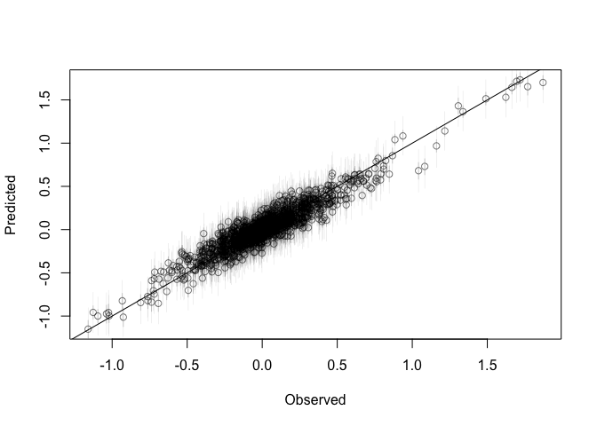
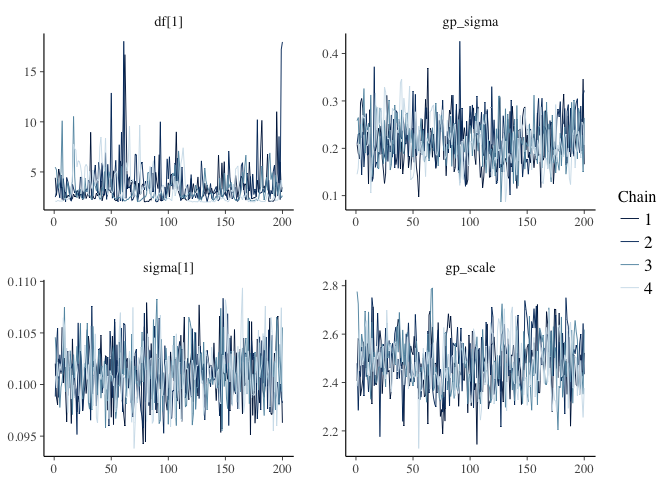
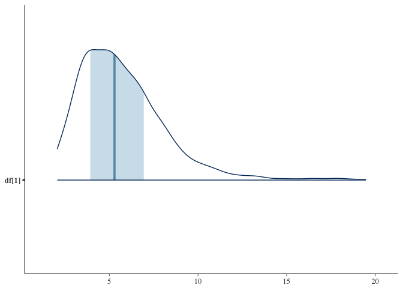

<!-- README.md is generated from README.Rmd. Please edit that file -->
glmmfields 
====================================================

[](https://travis-ci.org/seananderson/glmmfields) [](https://ci.appveyor.com/project/seananderson/glmmfields) <!-- [](https://codecov.io/github/seananderson/glmmfields) -->

The glmmfields R package implements Bayesian spatiotemporal models that allow for extreme spatial deviations through time. It uses a predictive process approach with random fields implemented through a multivariate-t distribution instead of a multivariate normal. The models are fit with [Stan](http://mc-stan.org/).

You can install the development version of the package with:

``` r
# install.packages("devtools")
devtools::install_github("seananderson/glmmfields")
```

An example model
----------------

Simulate data:

``` r
library(glmmfields)
set.seed(42)
s <- sim_glmmfields(df = 2.8, n_draws = 12, n_knots = 12, gp_theta = 2.5, 
  gp_sigma = 0.2, sd_obs = 0.1)
head(s$dat)
#>   time pt           y      lon      lat station_id
#> 1    1  1  0.02818963 9.148060 6.262453          1
#> 2    1  2 -0.21924739 9.370754 2.171577          2
#> 3    1  3 -0.34719485 2.861395 2.165673          3
#> 4    1  4 -0.15785483 8.304476 3.889450          4
#> 5    1  5 -0.04703617 6.417455 9.424557          5
#> 6    1  6 -0.23904924 5.190959 9.626080          6
```

``` r
print(s$plot)
```


Fit the model:

``` r
options(mc.cores = parallel::detectCores()) # for parallel processing
m <- glmmfields(y ~ 0, data = s$dat, time = "time",
  lat = "lat", lon = "lon",
  nknots = 12, estimate_df = TRUE, iter = 800)
```

``` r
print(m)
#> Inference for Stan model: glmmfields.
#> 4 chains, each with iter=800; warmup=400; thin=1; 
#> post-warmup draws per chain=400, total post-warmup draws=1600.
#> 
#>             mean se_mean   sd    2.5%     25%     50%     75%   97.5%
#> df[1]       3.68    0.04 1.42    2.05    2.65    3.36    4.36    7.51
#> gp_sigma    0.30    0.00 0.04    0.21    0.27    0.30    0.33    0.38
#> gp_theta    2.58    0.00 0.06    2.46    2.54    2.58    2.63    2.71
#> sigma[1]    0.10    0.00 0.00    0.09    0.10    0.10    0.10    0.10
#> lp__     2290.67    0.36 9.37 2270.92 2284.75 2290.96 2297.20 2308.32
#>          n_eff Rhat
#> df[1]     1054 1.00
#> gp_sigma   421 1.01
#> gp_theta  1600 1.00
#> sigma[1]  1600 1.00
#> lp__       677 1.00
#> 
#> Samples were drawn using NUTS(diag_e) at Fri Jul 28 12:15:46 2017.
#> For each parameter, n_eff is a crude measure of effective sample size,
#> and Rhat is the potential scale reduction factor on split chains (at 
#> convergence, Rhat=1).
```

Plot:

``` r
plot(m, type = "prediction") + ggplot2::scale_color_gradient2()
```


``` r
plot(m, type = "spatial-residual")
```


Predictions with credible intervals:

``` r
p <- predict(m, interval = "prediction", type = "response")
plot(s$dat$y, p$estimate, col = "#00000080", xlab = "Observed", ylab = "Predicted")
segments(s$dat$y, p$conf_low, s$dat$y, p$conf_high, lwd = 1, col = "#00000030")
abline(a = 0, b = 1)
```



Work with the Stan model:

``` r
library(bayesplot)
posterior <- rstan::extract(m$model, inc_warmup = FALSE, permuted = FALSE)
pars <- c("df[1]", "gp_sigma", "sigma[1]", "gp_theta")
mcmc_trace(posterior,  pars = pars)
```



``` r
mcmc_areas(as.matrix(m$model), pars = pars)
```



References
==========

Anderson, S. A., Ward, E. J. In review. Black swans in space: modelling spatiotemporal processes with extremes.

Latimer, A. M., S. Banerjee, H. Sang Jr, E. S. Mosher, and J. A. Silander Jr. 2009. Hierarchical models facilitate spatial analysis of large data sets: a case study on invasive plant species in the northeastern United States. Ecology Letters 12:144–154.

Shelton, A. O., J. T. Thorson, E. J. Ward, and B. E. Feist. 2014. Spatial semiparametric models improve estimates of species abundance and distribution. Canadian Journal of Fisheries and Aquatic Sciences 71:1655–1666.
